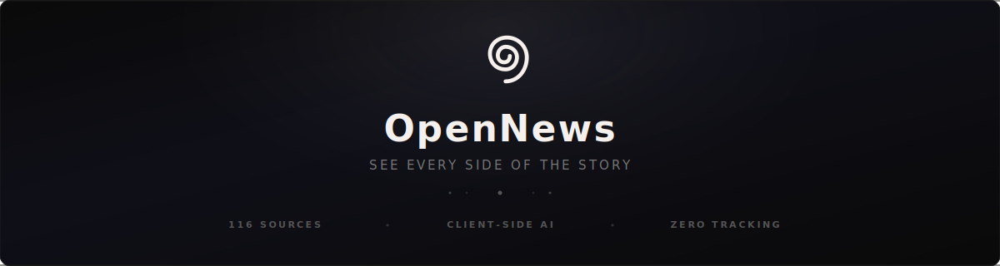
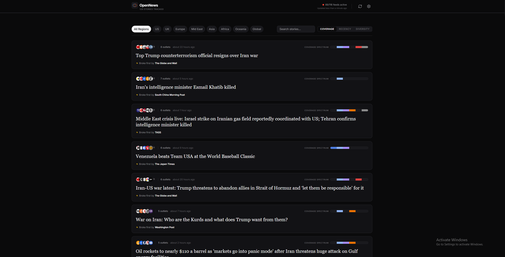
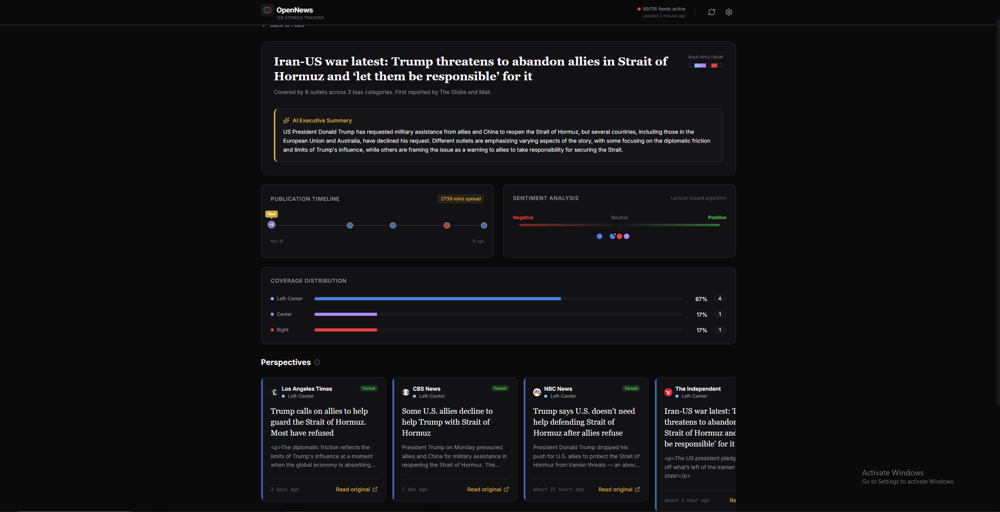
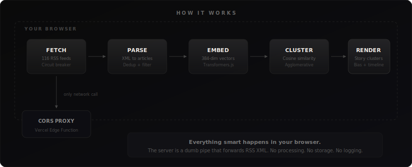
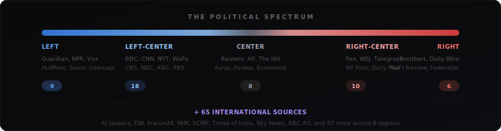

<div align="center">

<br/>



<br/>
<br/>

[](https://opennewsapp.vercel.app/)
&nbsp;&nbsp;
[](https://github.com/amruth112/CruxNews-OpenNews/stargazers)

<br/>

[](LICENSE)
[](https://www.typescriptlang.org/)
[](https://react.dev/)
[](https://huggingface.co/docs/transformers.js)
[](https://github.com/amruth112/CruxNews-OpenNews/actions/workflows/ci.yml)
[](CONTRIBUTING.md)

<br/>

<strong>
<a href="https://opennewsapp.vercel.app/">Live Demo</a>
&nbsp;&middot;&nbsp;
<a href="#-quick-start">Quick Start</a>
&nbsp;&middot;&nbsp;
<a href="CONTRIBUTING.md">Contribute</a>
&nbsp;&middot;&nbsp;
<a href="https://github.com/amruth112/CruxNews-OpenNews/issues/new?template=bug_report.md">Report Bug</a>
&nbsp;&middot;&nbsp;
<a href="https://github.com/amruth112/CruxNews-OpenNews/issues/new?template=add_feed.md">Request Feed</a>
</strong>

</div>

<br/>

---

<br/>

<table>
<tr>
<td width="50%">

**The Feed** — Story clusters across the political spectrum


</td>
<td width="50%">

**The Story Room** — AI summaries, timelines, sentiment


</td>
</tr>
</table>

<br/>

## The Problem

Every news app picks a side. Algorithms optimize for engagement, not understanding. You're trapped in a filter bubble you didn't choose — seeing one version of every story, never knowing what you're missing.

## The Solution

**OpenNews clusters identical stories from 116 sources across the political spectrum — entirely in your browser.**

No server processes your data. No algorithm decides what you see. No account tracks your reading habits. AI runs locally on your device via WebAssembly. The only network call is fetching raw RSS XML through a dumb CORS proxy.

> **You stop reading *a* perspective. You start reading *the* story.**

<br/>

---

<br/>

## Features

<table>
<tr>
<td width="50%" valign="top">

### Client-Side AI Clustering
Transformers.js runs the `all-MiniLM-L6-v2` model directly in your browser via WASM. Articles are embedded into 384-dimensional vectors and grouped using agglomerative clustering with cosine similarity. No data leaves your machine.

</td>
<td width="50%" valign="top">

### Bias Spectrum Analysis
Every source is rated using Media Bias/Fact Check data. See which outlets are covering a story — and which are ignoring it. The bias distribution visualization shows left, center, and right coverage at a glance.

</td>
</tr>
<tr>
<td width="50%" valign="top">

### Multi-Provider AI Summaries
Optional executive summaries that compare how outlets frame the same story. Choose from Ollama (free, local), Groq (free tier), Google Gemini (free tier), or OpenAI. All keys stay in localStorage.

</td>
<td width="50%" valign="top">

### 116 Sources, 8 Regions
US, UK, Europe, Middle East, Asia, Africa, Oceania, and Latin America. Left to right. Mainstream to independent. The most comprehensive open-source news aggregator available.

</td>
</tr>
<tr>
<td width="50%" valign="top">

### Publication Timelines
Who broke the story first? Watch coverage spread across outlets chronologically. See how narratives evolve from breaking news to analysis to opinion.

</td>
<td width="50%" valign="top">

### Circuit Breaker Resilience
Feeds that fail 3 times are automatically disabled for 10 minutes. The app stays fast regardless of how many sources are temporarily down. No single feed can degrade the experience.

</td>
</tr>
<tr>
<td width="50%" valign="top">

### Zero Cost, Zero Tracking
The core experience requires no API keys, no accounts, and no payments. No analytics, no cookies, no fingerprinting. Settings persist in localStorage. Article cache lives in sessionStorage.

</td>
<td width="50%" valign="top">

### One-Click Deploy
Fork it, deploy to Vercel in 30 seconds, and run your own instance. The entire application is static + one Edge Function. Total infrastructure cost: $0.

</td>
</tr>
</table>

<br/>

---

<br/>

## Architecture

<div align="center">

</div>

<br/>

---

<br/>

## The Spectrum

<div align="center">

</div>

<br/>

<details>
<summary><strong>View all 116 sources</strong></summary>

<br/>

| Category | Sources |
|:---------|:--------|
| **Left** <sup>9</sup> | The Guardian, NPR, HuffPost, Vox, The Intercept, Salon, Democracy Now!, Jacobin, Current Affairs |
| **Left-Center** <sup>18</sup> | BBC, CNN, NYT, Washington Post, ABC News, CBS News, NBC News, PBS, ProPublica, Al Jazeera, Time, The Atlantic, Politico, AP News*, USA Today, NPR Politics, Associated Press, Business Insider |
| **Center** <sup>8</sup> | Reuters, The Hill, The Economist, Forbes, Axios, BBC World*, RealClearPolitics, The Dispatch |
| **Right-Center** <sup>10</sup> | Fox News, Wall Street Journal, The Telegraph, NY Post, Daily Mail, Reason, Washington Examiner, The Spectator, RealClearPolitics, Washington Times |
| **Right** <sup>6</sup> | Breitbart, Daily Wire, National Review, The Federalist, Epoch Times, Newsmax |
| **International** <sup>65</sup> | DW, France24, Sky News, NHK, SCMP, Times of India, Dawn, ABC Australia, RTE, Xinhua, TASS, Haaretz, Jerusalem Post, The Hindu, Japan Times, Korea Herald, Bangkok Post, CNA, Straits Times, and 46 more |

<sup>Bias ratings derived from <a href="https://mediabiasfactcheck.com/">Media Bias/Fact Check</a>. International sources classified as independent.</sup>

</details>

<br/>

---

<br/>

## Quick Start

```bash
git clone https://github.com/amruth112/CruxNews-OpenNews.git
cd CruxNews-OpenNews
npm install --legacy-peer-deps
npm run dev
```

Open **http://localhost:5173**. The app downloads ~23 MB of AI models to IndexedDB on first visit. Subsequent loads are instant.

> `--legacy-peer-deps` is needed for Vite 8 + Tailwind v4 peer dependency resolution.

<div align="center">

[](https://vercel.com/new/clone?repository-url=https://github.com/amruth112/CruxNews-OpenNews)

</div>

<br/>

---

<br/>

## AI Summaries (Optional)

The core experience works with zero API keys. For AI-generated story summaries comparing outlet framing, pick any provider:

| Provider | Model | Cost | Setup |
|:---------|:------|:-----|:------|
| **Ollama** | Auto-detected | Free (local) | [Install Ollama](https://ollama.com/) — run `ollama run llama3.2` — auto-detected |
| **Groq** | llama-3.1-8b-instant | Free tier | Get key at [console.groq.com](https://console.groq.com/) |
| **Google Gemini** | gemini-2.0-flash-lite | Free tier | Get key at [aistudio.google.com](https://aistudio.google.com/apikey) |
| **OpenAI** | gpt-4o-mini | ~$0.15/1M tokens | Get key at [platform.openai.com](https://platform.openai.com/api-keys) |

All keys stored in `localStorage` — they never leave your browser.

<br/>

---

<br/>

## Tech Stack

| Layer | Technology |
|:------|:-----------|
| Framework | [React 19](https://react.dev/) + [TypeScript 5.9](https://www.typescriptlang.org/) (strict) |
| Build | [Vite 8](https://vite.dev/) |
| Styling | [Tailwind CSS 4](https://tailwindcss.com/) |
| AI/ML | [Transformers.js](https://huggingface.co/docs/transformers.js) — `all-MiniLM-L6-v2` |
| State | React Context + `useReducer` |
| Animation | [Framer Motion](https://www.framer.com/motion/) |
| Icons | [Lucide React](https://lucide.dev/) |
| Deployment | [Vercel](https://vercel.com/) — Static + Edge Functions |
| Testing | [Vitest](https://vitest.dev/) — 75 tests |

<details>
<summary><strong>Project structure</strong></summary>

```
CruxNews-OpenNews/
├── src/
│   ├── components/        # React UI
│   │   ├── home/          # Feed listing & story cards
│   │   ├── layout/        # Header, footer, layout shell
│   │   ├── settings/      # Settings modal & API key manager
│   │   ├── shared/        # Error boundary, badges, tooltips
│   │   └── story/         # Story Room detail view
│   ├── config/            # Feed definitions & source metadata
│   ├── services/          # Core logic — fetching, clustering, AI
│   ├── stores/            # React Context state management
│   ├── hooks/             # Custom hooks (feeds, clustering, settings)
│   ├── types/             # TypeScript interfaces
│   └── utils/             # Text processing, cosine similarity, time
├── api/
│   └── proxy.ts           # Vercel Edge Function (CORS proxy)
├── tests/                 # Unit tests
└── .github/               # CI, templates, Dependabot
```

</details>

<details>
<summary><strong>Available scripts</strong></summary>

| Command | Description |
|:--------|:-----------|
| `npm run dev` | Dev server at localhost:5173 |
| `npm run build` | TypeScript check + production build |
| `npm run test` | Run 75 unit tests |
| `npm run test:coverage` | Tests with coverage report |
| `npm run lint` | Lint with ESLint |
| `npm run format` | Format with Prettier |
| `npm run typecheck` | TypeScript strict mode check |

</details>

<br/>

---

<br/>

## Roadmap

- [ ] Custom RSS feeds — add your own sources in the UI
- [ ] Shareable story URLs — link to a multi-perspective view
- [ ] Service worker for offline reading
- [ ] Topic-based filtering (politics, tech, science, sports)
- [ ] Web Workers for clustering (eliminate UI freezes)
- [ ] Browser extension
- [ ] Full accessibility audit (WCAG 2.1 AA)
- [ ] i18n / multi-language interface

See [open issues](https://github.com/amruth112/CruxNews-OpenNews/issues) for the full list.

<br/>

---

<br/>

## Contributing

We'd love your help. See **[CONTRIBUTING.md](CONTRIBUTING.md)** for setup, code style, and the PR process.

The most impactful contribution? **Adding a new RSS feed.** [Open a feed request](https://github.com/amruth112/CruxNews-OpenNews/issues/new?template=add_feed.md).

## Security

Found a vulnerability? Please read our **[Security Policy](SECURITY.md)** and report via email. Do not open a public issue.

## License

MIT License. See **[LICENSE](LICENSE)**.

<br/>

---

<br/>

<div align="center">


<br/>
<br/>

**If OpenNews helps you see the bigger picture, consider giving it a star.**

It helps others discover the project and keeps us motivated.

<br/>

**[Star this repo](https://github.com/amruth112/CruxNews-OpenNews)** &nbsp;&middot;&nbsp; **[Try the demo](https://opennewsapp.vercel.app/)** &nbsp;&middot;&nbsp; **[Join the discussion](https://github.com/amruth112/CruxNews-OpenNews/discussions)**

<br/>

<sub>Built by <a href="https://cruxnews.io">CruxNews</a></sub>

<br/>
<br/>

</div>
